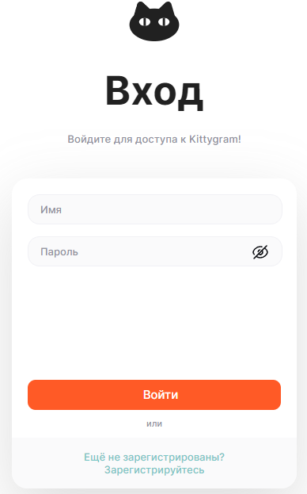
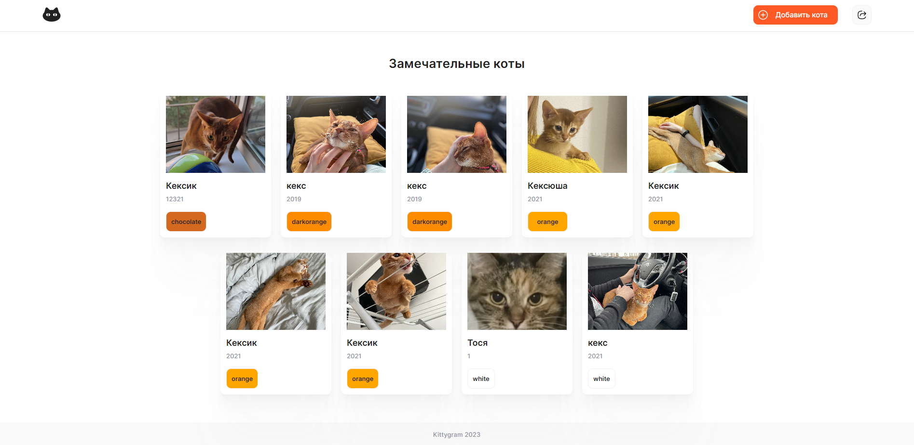
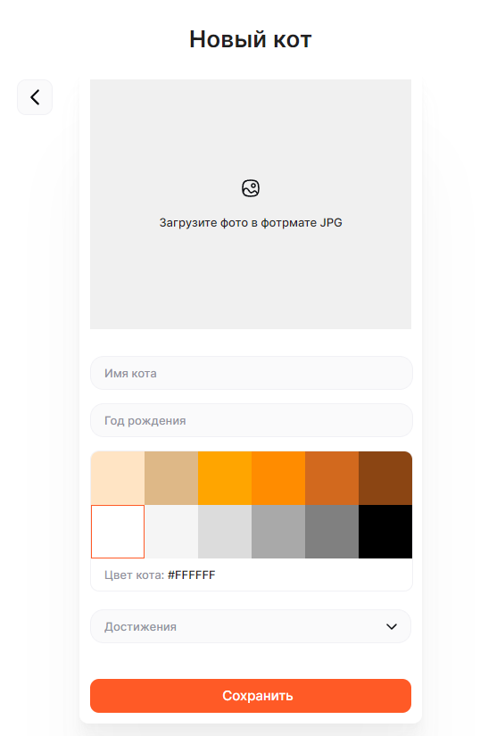

# Описание проекта

Kittygram - это веб-приложение для хранения фотографий и достижений вашего котика

Особенности:
* Размещение фотографий и достижений котиков;
* Выбор цвета котика;


## Технологии
Backend: Python, Django, Django Rest Framework

Frontend: JS, CCS, HTML

## Скриншоты:


&nbsp;

&nbsp;

&nbsp;

### Как запустить проект:

Клонировать репозиторий и перейти в него в командной строке:

```
git clone git@github.com:Dragonwlad/Kittygram.git
```

### Запуск бэкенда:

```
cd kittygram_backend
```

Cоздать и активировать виртуальное окружение:

```
python -m venv venv
```

```
source env/scripts/activate
```

```
python3 -m pip install --upgrade pip
```

Установить зависимости из файла requirements.txt:

```
pip install -r requirements.txt
```

Выполнить миграции:

```
python manage.py migrate
```

Запустить проект:

```
python manage.py runserver
```

### Запуск фронтенда:

```
cd kittygram_frontend
```

Установить зависимости:

```
npm i
```

Запустить проект:

```
npm run start
```

Проект доступен по адресу:

```
http://localhost:3000/
```

## Автор:
Backend: [Владислав Кузнецов](https://github.com/Dragonwlad)

Frontend: Yandex-Praktikum
